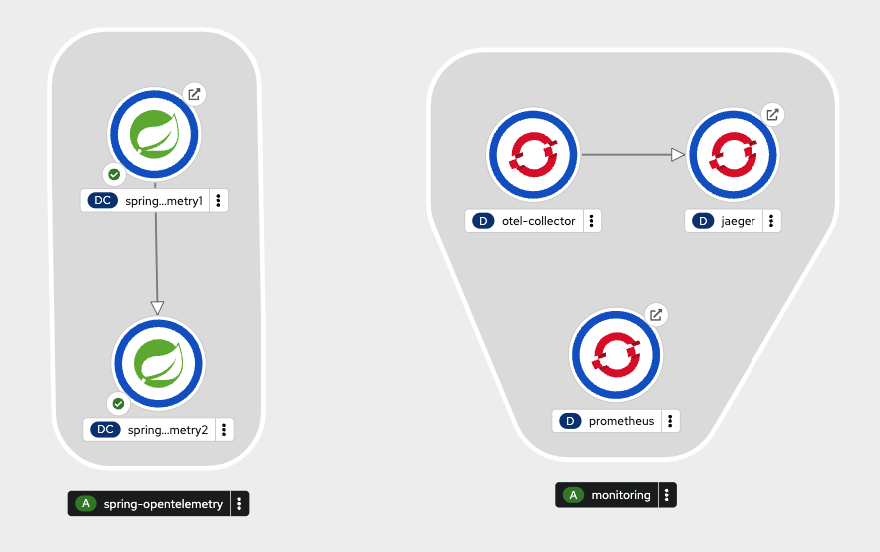

# Spring Boot & OpenTelemetry

## Create namespace
``oc new-project spring-observability``

## Local
``mvn spring-boot:run -Dmaven.test.skip=true``

## Deployment on OpenShift
``mvn clean fabric8:deploy -Popenshift -Dmaven.test.skip=true``

## Monitoring stack
### OpenTelemetry Collector + Prometheus + Jaeger
``oc create -n spring-observability -f monitoring.yaml``

### Grafana (Community operator)
``oc create -n grafana -f grafana/operator-deploy.yaml``

## Topology view

## Relevant Articles
- [OpenTelemetry Setup in Spring Boot Application](https://www.baeldung.com/spring-boot-opentelemetry-setup)